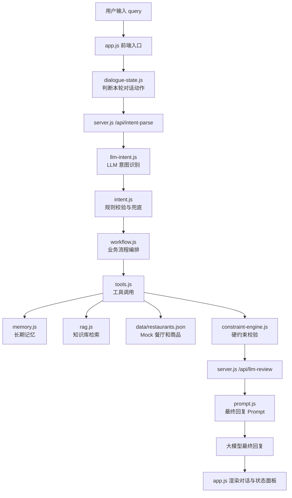

# 外卖点餐 Agent 架构说明

这份文档的目的，是帮你建立一张清晰的系统地图。

你现在做的不是一个普通网页，而是一个简化版 Agent 系统。它包含自然语言理解、短期状态、长期记忆、工具调用、业务流程、约束校验和大模型最终回复。

## 一句话理解当前架构

```text
用户说一句需求，Agent 先判断这句话在当前对话里的作用，再把它变成结构化任务，调用工具查数据，校验结果是否违反约束，最后交给大模型生成用户能看懂的回复。
```

## 总体数据流



## 模块分工

| 模块 | 文件 | 解决什么问题 | 输入 | 输出 |
| --- | --- | --- | --- | --- |
| 页面入口 | `app.js` | 管理前端状态、用户输入、渲染和 API 调用 | 用户输入、服务端结果 | 页面消息、状态面板 |
| 对话状态 | `dialogue-state.js` | 判断用户这一句是在新点餐、改条件、换一批、选店还是选菜 | 当前 query、上一轮状态 | `DialogueState` |
| 规则意图 | `intent.js` | 稳定抽取基础意图和槽位，作为兜底 | query | `IntentResult` |
| LLM 意图 | `llm-intent.js` | 让大模型理解复杂表达，再规范成结构化 JSON | query、上下文、用户画像 | 结构化意图 |
| 业务流程 | `workflow.js` | 决定这一轮应该走 RAG、工具、推荐、规划还是记忆 | `IntentResult` | `WorkflowResult` |
| 工具调用 | `tools.js` | 查餐厅、排序、查菜单、排序商品、写记忆 | 结构化参数 | 工具结果 |
| 约束引擎 | `constraint-engine.js` | 拦截违反硬约束的推荐 | `UserNeed`、候选餐厅、候选商品 | `ConstraintAudit` |
| 长期记忆 | `memory.js` | 管理用户画像、偏好、忌口、待确认记忆 | 用户画像、当前需求 | 相关记忆 |
| 知识库 | `rag.js` | 查询饮食知识、减脂、忌口建议 | 知识 query | 知识片段 |
| 复杂规划 | `planning.js` | 处理多人、多约束任务 | 复杂需求 | 规划候选 |
| 安全确认 | `safety.js` | 保存长期记忆前要求用户确认 | Workflow 结果 | 待确认动作 |
| 模型服务 | `server.js` | 保护 API Key，代理 LLM 请求 | 前端请求 | LLM 意图或最终回复 |
| Prompt | `prompt.js` | 约束最终回复格式和边界 | Agent 状态 | LLM prompt |

## 核心状态对象

### `DialogueState`

回答的问题是：

```text
用户这句话在当前对话里是什么意思？
```

典型动作：

- `new_order_request`：新的点餐需求
- `refine_constraints`：修改上一轮条件
- `request_alternatives`：想看上一批之外的餐厅
- `select_restaurant`：用户选择某家店
- `select_dish`：用户选择某个商品
- `ask_agent_identity`：询问模型或能力边界

### `IntentResult`

回答的问题是：

```text
用户想做什么？需要走哪条能力链路？
```

它包含：

- `intent`：意图类型
- `route`：路由到哪个能力
- `slots`：预算、配送时间、口味、忌口、餐厅名等槽位
- `missingSlots`：是否缺少关键信息
- `clarificationQuestion`：缺槽时应该问什么

### `UserNeed`

回答的问题是：

```text
这次点餐任务的结构化需求是什么？
```

它是工具调用和推荐排序真正使用的任务单，包括：

- `budget`
- `maxDeliveryMinutes`
- `deliveryTimeStrict`
- `tasteGoals`
- `avoidIngredients`
- `excludedRestaurantNames`
- `mealContext`

### `ConstraintAudit`

回答的问题是：

```text
推荐结果有没有违反用户的硬约束？
```

例如：

- 用户说必须 20 分钟以内，就不能出现 24 分钟餐厅
- 用户说清淡，就不能推荐川湘烧烤
- 用户说不吃牛肉，就不能推荐牛肉相关餐厅或商品
- 用户说不要刚才三家，就不能重复推荐已看过餐厅

## LLM 和规则如何分工

当前不是纯 LLM，也不是纯规则，而是混合架构。

### LLM 适合做什么

- 理解自然语言
- 处理口语化表达
- 识别隐含约束
- 整合工具结果生成自然回复

### 规则适合做什么

- 确定路由边界
- 校验 JSON 字段
- 兜底模型失败
- 处理安全边界
- 保证评测稳定可复现

### 为什么不能只靠 LLM

如果完全靠 LLM，可能出现：

- 把“你是什么模型”误判成知识库查询
- 为了显得有答案而编造餐厅、配送时间或销量
- 忘记上一轮预算和口味
- 把长期偏好当成本轮硬约束
- 推荐违反忌口的商品

所以现在的原则是：

```text
LLM 负责理解和表达，规则和工具负责执行与校验。
```

## 硬约束与软偏好

这是目前最重要的产品原则之一。

### 硬约束

不能违反。

例子：

- 必须 20 分钟以内
- 不吃牛肉
- 不要辣
- 不要刚才三家
- 清淡一点

### 软偏好

用于排序，但不是绝对命令。

例子：

- 平时喜欢川菜
- 希望销量高一点
- 预算 35 左右
- 更喜欢热食
- 距离近一点

### 当前排序优先级

```text
本轮明确 query
> 多轮短期状态
> 安全和权限边界
> 硬约束校验
> 工具数据
> 长期记忆软排序
> 默认假设
```

这意味着：如果用户这次说“清淡一点”，即使长期画像里写着喜欢川菜，也不能推荐川湘烧烤作为主推荐。

## 一个完整例子

用户输入：

```text
20 分钟内送到，清淡一点，预算 35 元左右。
```

系统内部会这样走：

1. `app.js` 收到用户输入，立刻显示“正在思考”
2. `dialogue-state.js` 判断这是新的点餐需求
3. `server.js` 调用 `/api/intent-parse`
4. `llm-intent.js` 用大模型抽取槽位
5. `intent.js` 做规则校验和兜底
6. `workflow.js` 判断应该进入餐厅推荐 Workflow
7. `memory.js` 读取用户画像和长期记忆
8. `rag.js` 检索饮食知识，作为内部辅助
9. `tools.js` 搜索并排序 Mock 餐厅
10. `constraint-engine.js` 过滤掉不符合清淡和 20 分钟要求的餐厅
11. `server.js` 调用 `/api/llm-review`
12. `prompt.js` 要求大模型只基于工具结果生成最终回复
13. `app.js` 展示 3 家餐厅，并更新短期上下文

## 当前产品状态

已经具备：

- 基础 Web Demo
- 真实大模型服务端代理
- LLM 意图识别
- 规则兜底
- RAG
- 工具调用
- Workflow
- 长期记忆
- Dialogue State
- Constraint Engine
- 自动化评测

还没有完全解决：

- 单句多意图编排：例如“以后默认不要香菜，今天想吃清淡点”
- 多人强冲突拆解：例如一个人想吃川菜，一个人完全不吃辣
- 真实高德地图 API：当前配送时间和距离仍是 Mock
- 真实外卖平台接口：当前不做下单和支付

## 接下来怎么学

建议按这个顺序理解代码：

1. 先看 `docs/ARCHITECTURE.md`，建立总图
2. 再看 `PROGRESS.md` 的模块化路线图
3. 看 `app.js`，理解用户输入如何进入系统
4. 看 `dialogue-state.js`，理解多轮对话状态
5. 看 `llm-intent.js` 和 `intent.js`，理解 LLM 与规则如何配合
6. 看 `workflow.js`，理解业务流程如何编排
7. 看 `tools.js` 和 `constraint-engine.js`，理解工具和约束如何保证结果可靠
8. 最后看 `evals/`，理解如何用场景评测 Agent

## 下一步优化建议

最建议做的是：

```text
7.2 Multi-intent 编排
```

因为真实用户很容易一句话里同时表达两个动作：

```text
以后默认不要香菜，今天想吃清淡点，35 元以内。
```

理想 Agent 应该同时：

- 生成“是否保存不吃香菜”的待确认记忆
- 继续执行“今天清淡、35 元以内”的点餐推荐

这会让你真正理解 Agent 的任务拆分、并行子任务和状态合并。
